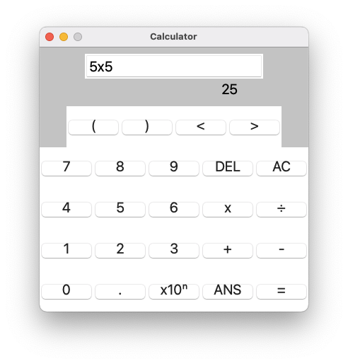
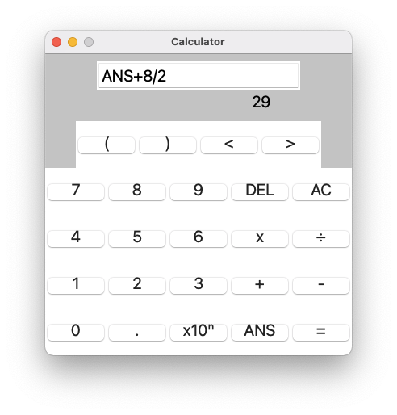
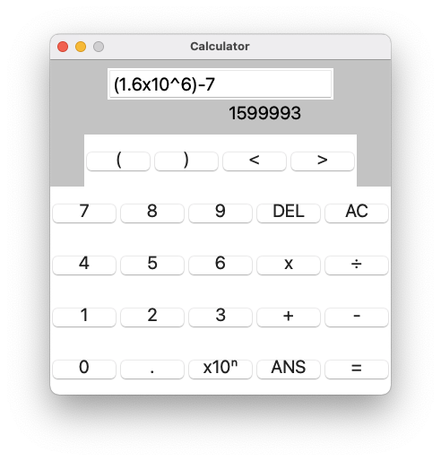

## Calculator

A simple calculator app, using Python's Tkinter GUI package.

### Description
I wrote this app as a personal challenge when teaching myself Python 2.7, in 2014. I wanted the program to do everything I used on my physical calculator. At the time I was working as a cell biologist, using a calculator all day. I was frustrated that I couldn't find any simple calculator apps for my phone that included an EXP or x10x button. Most of my calculations tended to involve very large numbers (e.g. millions of cells) or very small (e.g. microlitres of liquid), so the EXP button was essential. My initial goal was to transfer this code to the Kivy framework to create an iOS app.

This was my first ever coding project! I had completed the [Codecademy](https://www.codecademy.com/learn) Python course but didn't know anything about clean code, testing, or how to structure my work. I soon realised that making an iOS app would be rather ambitious, so I decided to leave it at this.

- The calculator has the standard operations <code>+</code>, <code>-</code>, <code>*</code> and <code>/</code>, plus brackets, plus a <code>x10^n</code> aka EXP button. For example, <code>22000000</code> can be entered as <code>2.2</code> <code>x10^n</code> <code>7</code>. Similarly, <code>0.00003</code> can be entered as <code>3</code> <code>x10^n</code> <code>-5</code>.
- Enter numbers and operations using mouse clicks/buttons, or keyboard.
- The whole calculation is visible in the display. You can edit before getting the answer, using the arrow keys and <code>DEL</code>.
- Once an answer has been obtained, the <code>ANS</code> button now holds the most recent answer. For example, <code>6 * 4</code> <code>=</code> <code>24</code>. Then <code>ANS + 1</code> <code>=</code> <code>25</code>. Continuing to press the <code>=</code> key will keep adding 1 as the number stored in <code>ANS</code> is updated.
Pressing <code>AC</code> clears the input area and the saved <code>ANS</code>.
- Uses regex and input checking to prevent entry of illegal combinations of characters, such as <code>1..</code> or <code>/*</code>.

It looks like this:

  
### Installation and Usage
This project is written in Python 2.7, which is now depreciated.  
* Python 2.7 comes preinstalled on Mac computers. Install it manually if using Windows.
* Clone this repo and navigate into the folder
* Start the app: `python2 Main.py`
* Calculate!

### Known Issues
* The code needs updating to a current Python version. This would also ideally involve a complete refactor (some of the methods are over 70 lines long!)
* There are no error messages to the user e.g for divide by zero. Adding these would improve the user experience.
